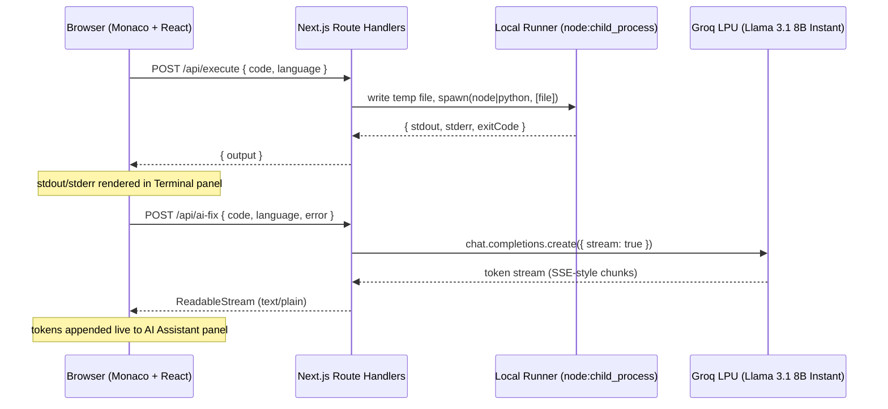

# ⚡ HackRepl

**A zero-setup, cloud-native code workspace with a sub-second AI pair programmer built in.**

[](https://nextjs.org)
[](https://www.typescriptlang.org)
[](https://groq.com)
[](https://tailwindcss.com)
[](./LICENSE)

---

## Why HackRepl

Every "write code, run code, fix code" loop today pays the same tax three times over:

| Friction point | What it costs you |
| --- | --- |
| **Local environment setup** | Installing interpreters, managing versions, configuring PATH — before you've written a single line relevant to the problem. |
| **Context-switching to debug** | Copying a stack trace out of your terminal, pasting it into a separate chat tab, re-pasting your source file, and losing your editor's cursor position in the process. |
| **Slow AI round-trips** | Waiting multiple seconds per token on general-purpose chat models when you just need "what's broken and how do I fix it" — not a conversation. |

**HackRepl collapses all three into one browser tab.** It pairs a real Monaco (VS Code) editor with a local multi-language execution engine and an AI debugger that already has your code *and* your terminal output in context — no copy-paste, no tab-switching, no setup. Because the AI runs on Groq's LPU inference stack instead of a traditional GPU-serving stack, fixes stream back while you're still reading the error.

It's built for the moments where speed matters most: **hackathons**, **technical interviews**, and **learning a new language** without touching a terminal.

---

## Architecture

HackRepl is a thin, mostly-stateless Next.js layer. AI inference is delegated to Groq; code execution runs locally on the Next.js server itself via `child_process` — see the security note below before you consider this section "no attack surface."



**Design decisions worth calling out:**

- **No server-side session state.** Every request is self-contained — source, language, and (for the AI route) the last terminal trace are sent fresh each call. This makes the app trivially horizontally scalable and removes an entire class of session-management bugs.
- **Streaming all the way down.** `/api/ai-fix` returns a raw [`ReadableStream`](https://developer.mozilla.org/en-US/docs/Web/API/ReadableStream) rather than buffering the full completion — the client reads it with `res.body.getReader()` so tokens paint the screen as Groq emits them, not after the full response lands.
- **Execution is local, not sandboxed — by design tradeoff, not oversight.** `/api/execute` writes the submitted code to a temp file and runs it with `child_process.spawn` (never `exec`/`shell: true`, so there's no shell-metacharacter injection on top of the intentional code execution) using the same Node binary that runs the server, or the host's `python`/`python3`. The child process gets a stripped-down environment (just `PATH` and the OS bits Windows needs to resolve `python`) so it can't read `GROQ_API_KEY` or other server secrets, and it's killed on a 10s timeout or if output exceeds ~200KB. **This is a zero-dependency, zero-latency tradeoff for local/single-user use (hackathon demos, your own machine) — it is not a sandbox.** Read [Security Model](#security-model) before deploying this anywhere multi-tenant.
- **The AI context is engineered, not generic.** The `/api/ai-fix` prompt couples the *exact* source in the editor with the *exact* stdout/stderr from the last run, so the model is debugging your real failure — not guessing from a description of it.

### Security Model

> **`/api/execute` runs arbitrary submitted code directly on the machine hosting the Next.js server.** There is no container, VM, network isolation, or filesystem jail — only a timeout, an output cap, and a stripped child environment. That's an acceptable tradeoff for a tool one trusted developer runs locally, and it's the reason this project ships with zero infra dependencies. **It is not acceptable for a publicly reachable, multi-tenant deployment** — anyone who can reach `/api/execute` on such a deployment gets arbitrary code execution as the server's OS user, which means they can read the filesystem, hit your internal network, and exhaust CPU/memory on the host.
>
> If you need to expose this to untrusted users (a public demo, a shared classroom instance, etc.), put real sandboxing back in front of it — e.g. run the spawned process inside a locked-down container (gVisor/Firecracker/Docker with `--network none`, a read-only rootfs, and cgroup limits), or swap the runner back for an isolated execution service like [Piston](https://github.com/engineer-man/piston) or [Judge0](https://judge0.com/). Do not deploy this route as-is behind a public URL.

---

## Core Features

- 🖊️ **In-browser VS Code editing** — Monaco Editor (`@monaco-editor/react`) with syntax highlighting, bracket matching, and multi-cursor editing, no local install required.
- 🧪 **Zero-dependency local runtime** — Node.js and Python execution via `child_process`, with per-run temp files, output capping, and a hard timeout (see the [Security Model](#security-model) for what this does and doesn't protect against).
- 🩹 **One-click "AI Fix & Explain"** — couples your source code with the real terminal trace from the last run into a single diagnostic prompt, instead of making you describe the bug yourself.
- ⚡ **Sub-second streaming AI responses** — powered by Groq's LPU inference engine running `llama-3.1-8b-instant`, so explanations and patches render token-by-token in real time.
- 🌓 **Distraction-free split workspace** — a dark-mode, three-pane layout (editor / terminal / AI assistant) designed to keep your eyes in one place.

---

## Tech Stack

| Layer | Technology |
| --- | --- |
| **Frontend framework** | [Next.js](https://nextjs.org) (App Router) + [React](https://react.dev) |
| **Styling** | [Tailwind CSS](https://tailwindcss.com) |
| **Editor** | [Monaco Editor](https://microsoft.github.io/monaco-editor/) via `@monaco-editor/react` |
| **Icons** | [Lucide React](https://lucide.dev) |
| **API layer** | Next.js Route Handlers + the native [Web Streams API](https://developer.mozilla.org/en-US/docs/Web/API/Streams_API) |
| **Execution engine** | Node.js [`child_process`](https://nodejs.org/api/child_process.html) (`spawn`) running locally — no external service, no containers |
| **AI engine** | [Groq SDK](https://console.groq.com/docs/libraries) — `llama-3.1-8b-instant`, streamed |

---

## Getting Started

### Prerequisites

- **Node.js 18+**
- **npm** (or `pnpm` / `yarn` / `bun` — any Next.js-compatible package manager)
- **Python 3** on your `PATH` if you want the Python runtime to work (`python` on Windows, `python3` elsewhere) — the JS runtime needs nothing extra, it reuses the Node binary already running the server
- A [Groq API key](https://console.groq.com/keys) (free tier available)

### 1. Clone and install

```bash
git clone https://github.com/<your-org>/hackrepl.git
cd hackrepl
npm install
```

### 2. Configure environment variables

Copy the example file and add your Groq key:

```bash
cp .env.example .env.local
```

| Variable | Required | Description |
| --- | --- | --- |
| `GROQ_API_KEY` | ✅ | API key from the [Groq Console](https://console.groq.com/keys), used server-side by `/api/ai-fix`. Never exposed to the client. |

### 3. Run the dev server

```bash
npm run dev
```

Open [http://localhost:3000](http://localhost:3000) — you'll land directly in the workspace with a pre-loaded, intentionally-buggy snippet so you can try "AI Fix & Explain" immediately.

> **Note:** code execution runs locally via `child_process` — no external service, no API key, no account to whitelist. See [Security Model](#security-model) for what that means if you ever deploy this beyond your own machine.

---

## API Endpoints

### `POST /api/execute`

Writes the submitted code to a temp file and runs it locally as a child process, returning its captured output. **Not sandboxed** — see [Security Model](#security-model).

**Request body:**

```json
{
  "code": "console.log('hello world')",
  "language": "javascript"
}
```

`language` accepts `"javascript"` (runs on the host's Node binary) or `"python"` (runs on `python`/`python3`).

**Response:**

```json
{ "output": "hello world\n" }
```

Execution is capped at a 10s timeout (`408` on timeout) and ~200KB of combined stdout/stderr, after which the process is killed and the output is truncated.

On failure (bad payload, unsupported language, missing interpreter, or a timeout), responds with a non-2xx status and:

```json
{ "error": "description of what went wrong" }
```

### `POST /api/ai-fix`

Streams an AI diagnosis and patched code for a given code + error pair.

**Request body:**

```json
{
  "code": "function total(items) { ... }",
  "language": "javascript",
  "error": "ReferenceError: pric is not defined"
}
```

**Response:** `Content-Type: text/plain; charset=utf-8`, body is a raw token stream — **not** JSON, and **not** newline-delimited. Consume it directly:

```ts
const res = await fetch("/api/ai-fix", { method: "POST", body: JSON.stringify(payload) });
const reader = res.body!.getReader();
const decoder = new TextDecoder();

while (true) {
  const { done, value } = await reader.read();
  if (done) break;
  appendToUI(decoder.decode(value, { stream: true }));
}
```

Returns `429` with a plain-text rate-limit message if the Groq API is throttled, so the client can surface it without crashing the stream reader.

---

## Roadmap

- [ ] **AST-aware diff patching** — instead of pasting a full replacement snippet, parse the AI's suggested fix and apply it as a minimal, reviewable diff directly onto the Monaco model.
- [ ] **Multi-user WebRTC pairing** — peer-to-peer shared cursors and live editing for pair-programming interviews, without routing keystrokes through a server.
- [ ] **Custom test-case assertions** — let users define input/expected-output pairs and run them as a lightweight test suite against the sandbox, turning HackRepl into a self-checking practice tool.
- [ ] **Persistent, shareable sessions** — save a workspace (code + language + run history) to a URL so it can be shared for interviews, code review, or bug reports.

---

## License

Released under the [MIT License](./LICENSE).
